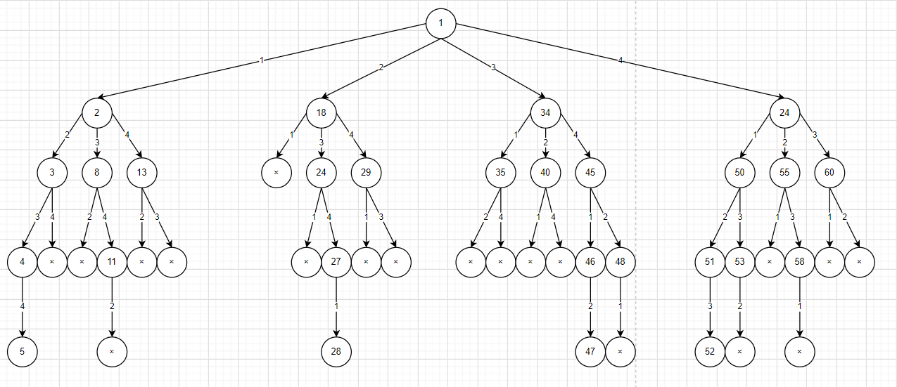
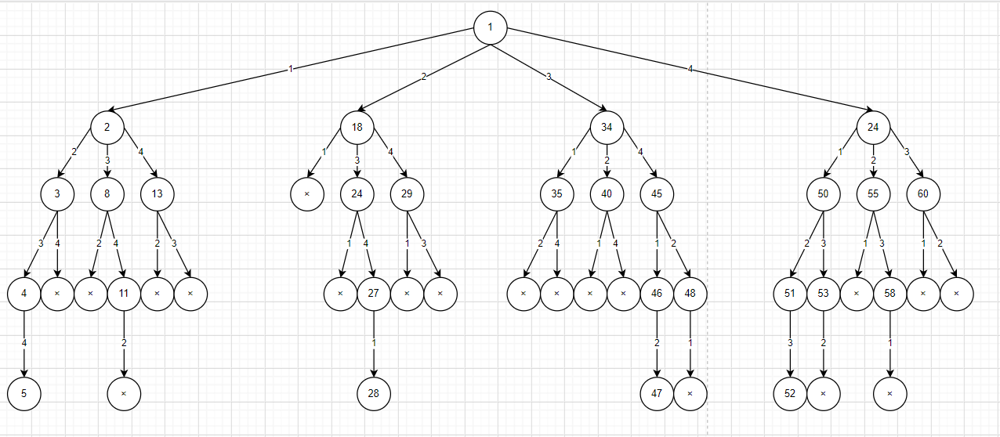

# 旅行售货员问题TSP

# 2018211302班 2018210074 熊宇

[toc]

<div style="page-break-after:always"></div>

## 一、回溯法

### 1.解向量

因为是四城市，构建一个四维向量$(x_1,x_2,x_3,x_4)$，表示旅行路径为：$x_1 -\rangle x_2 -\rangle x_3 -\rangle x_4$。

### 2.解空间树


### 3.剪枝策略

将bestCost设定为maxCost，根据这个bestCost去剪枝。

算法搜索至解空间树的任一结点时，总是先判断该结点是否肯定不包含问题的解。如果肯定不包含，则跳过对以该结点为根的子树的系统搜索，逐层向其祖先结点回溯。否则，进入该子树，继续按深度优先的策略进行搜索。回溯法在用来求问题的所有解时，要回溯到根，且根结点的所有子树都已被搜索遍才结束。而回溯法在用来求问题的任一解时，只要搜索到问题的一个解就可以结束。

### 4.对于树的剪枝



### 5.代码实现

```c++
/*****************************************************************
 * Copyright (c)2020, by Septer(Xiong Yu), Beijing University of Posts and Telecommunication
 * All rights reserved.
 * FileName：		    tsp.cpp
 * System：          	Algorithm design and analysis
 * SubSystem：        	Backtracking
 * Author：		Septer(Xiong Yu)
 * Date：		2020.12.1
 * Version：		2.0
 * Description：
        求解课件4城市图的旅行售货员问题
 *
 * Last Modified:

    2020.12.7, 	By Septer(Xiong Yu)
*****************************************************************/

#include <iostream>
#include <algorithm>
#include <stdio.h>
#include <stdlib.h>
#include <iomanip>
#include <math.h>
#include <vector>

using namespace std;

#define cityNum 4
#define edgeNum 16
#define maxCost 0x3f3f3f

int currentCost;           //当前路径长度
int bestCost;              //最佳路径长度
int path[cityNum + 1];     //各城市路径
int bestPath[cityNum + 1]; //各城市最好路径
int start;                 //出发城市

//4城市距离矩阵
int dis[cityNum + 1][cityNum + 1] = {
    -1, -1, -1, -1, -1,
    -1, -1, 3, 6, 7,
    -1, 12, -1, 2, 8,
    -1, 8, 6, -1, 2,
    -1, 3, 7, 6, -1
};

/*
-1, -1, -1, -1, -1,
    -1, -1, 3, 6, 7,
    -1, 12, -1, 2, 8,
    -1, 8, 6, -1, 2,
    -1, 3, 7, 6, -1
*/

void Initial();            //初始化
void Swap(int &a, int &b); //交换
void BackTrack(int i);     //第i步去的城市
void Output();             //输出结果

int main()
{
    Initial();
    start = 1;
    BackTrack(2);
    Output();
    system("pause");
    return 0;
}

/////////////////////////////////////////////////////////////////////
// Function：		Initial
// Description:
//	初始化变量
// Args：
//	无
// Return Values:
//      void
//      无描述
/////////////////////////////////////////////////////////////////////
void Initial()
{
    currentCost = 0;
    bestCost = maxCost;
    for (int i = 1; i <= cityNum; i++)
    {
        path[i] = i;
    }
}

/////////////////////////////////////////////////////////////////////
// Function：		Swap
// Description:
//	交换两变量值
// Args：
//	Arg1	int&  待交换变量A
//	Arg2	int&  待交换变量B
// Return Values:
//      void
//      无描述
/////////////////////////////////////////////////////////////////////
void Swap(int &a, int &b)
{
    int temp;
    temp = a;
    a = b;
    b = temp;
}

/////////////////////////////////////////////////////////////////////
// Function：		BackTrack
// Description:
//	求解第i步前往的城市
// Args：
//	Arg1	int  售货员旅行的第i步
// Return Values:
//      void
//      无描述
/////////////////////////////////////////////////////////////////////
void BackTrack(int i)
{
    if (i == cityNum)
    {
        if ((dis[path[i - 1]][path[i]] != -1) && (dis[path[i]][path[1]] != -1) && (currentCost + dis[path[i - 1]][path[i]] + dis[path[i]][path[start]] < bestCost || bestCost == maxCost))
        {
            bestCost = currentCost + dis[path[i - 1]][path[i]] + dis[path[i]][path[1]];
            for (int j = 1; j <= cityNum; j++)
            {
                bestPath[j] = path[j];
            }
        }
    }
    else
    {
        for (int j = i; j <= cityNum; j++)
        {
            if ((dis[path[i - 1]][path[j]] != -1) && (currentCost + dis[path[i - 1]][path[j]] < bestCost || bestCost == maxCost))
            {
                Swap(path[i], path[j]); //交换了i和j的位置
                currentCost += dis[path[i - 1]][path[i]];
                BackTrack(i + 1);
                currentCost -= dis[path[i - 1]][path[i]];
                Swap(path[i], path[j]);
            }
        }
    }
}

/////////////////////////////////////////////////////////////////////
// Function：		Output
// Description:
//	输出
// Args：
//	无
// Return Values:
//      void
//      无描述
/////////////////////////////////////////////////////////////////////
void Output()
{
    cout << "最佳路线为：";
    for (int i = 1; i <= cityNum; i++)
    {
        cout << bestPath[i] << "->";
    }
    cout << start << endl;
    cout << "最佳路径长度为：" << bestCost << endl;
}
```


<div style="page-break-after:always"></div>

## 二、结合贪心的回溯法

### 1.解向量

因为是四城市，构建一个四维向量$(x_1,x_2,x_3,x_4)$，表示旅行路径为：$x_1 -\rangle x_2 -\rangle x_3 -\rangle x_4$。

### 2.解空间树



### 3.剪枝策略

利用贪心算法在全局范围内求取一个局部最优可行解，将该解向量得到的最短值去更新bestCost，而不是纯回溯里的maxCost，然后根据这个bestCost去剪枝，可以剪掉更多枝。

算法搜索至解空间树的任一结点时，总是先判断该结点是否肯定不包含问题的解。如果肯定不包含，则跳过对以该结点为根的子树的系统搜索，逐层向其祖先结点回溯。否则，进入该子树，继续按深度优先的策略进行搜索。回溯法在用来求问题的所有解时，要回溯到根，且根结点的所有子树都已被搜索遍才结束。而回溯法在用来求问题的任一解时，只要搜索到问题的一个解就可以结束。

### 4.对于树的剪枝

### 5.代码实现

```c++
/*****************************************************************
 * Copyright (c)2020, by Septer(Xiong Yu), Beijing University of Posts and Telecommunication
 * All rights reserved.
 * FileName：		    tsp_greedy.cpp
 * System：          	Algorithm design and analysis
 * SubSystem：        	Backtracking Greedy
 * Author：		Septer(Xiong Yu)
 * Date：		2020.12.2
 * Version：		2.0
 * Description：
        求解课件4城市图的旅行售货员问题
 *
 * Last Modified:

    2020.12.9, 	By Septer(Xiong Yu)
*****************************************************************/

#include <iostream>
#include <algorithm>
#include <stdio.h>
#include <stdlib.h>
#include <iomanip>
#include <math.h>
#include <vector>

using namespace std;

#define cityNum 4
#define edgeNum 16
#define maxCost 0x3f3f3f

int currentCost;           //当前路径长度
int bestCost;              //最佳路径长度
int path[cityNum + 1];     //各城市路径
int bestPath[cityNum + 1]; //各城市最好路径
int start;                 //出发城市

//4城市距离矩阵
int dis[cityNum + 1][cityNum + 1] = {
    -1, -1, -1, -1, -1,
    -1, -1, 3, 6, 7,
    -1, 12, -1, 2, 8,
    -1, 8, 6, -1, 2,
    -1, 3, 7, 6, -1
};

/*
-1, -1, -1, -1, -1,
    -1, -1, 3, 6, 7,
    -1, 12, -1, 2, 8,
    -1, 8, 6, -1, 2,
    -1, 3, 7, 6, -1
*/

void Initial();            //初始化
int GetPos(int pos, vector <int> p);       //求解下一步要走的城市
void Greedy();             //贪心求局部最优
void Swap(int &a, int &b); //交换
void BackTrack(int i);     //第i步去的城市
void Output();             //输出结果

int main()
{
    Initial();
    Greedy();
    start=1;
    //cout<<start<<" "<<currentCost<<" "<<bestCost<<endl;
    BackTrack(2);
    Output();
    system("pause");
    return 0;
}

/////////////////////////////////////////////////////////////////////
// Function：		Initial
// Description:
//	初始化变量
// Args：
//	无
// Return Values:
//      void
//      无描述
/////////////////////////////////////////////////////////////////////
void Initial()
{
    currentCost = 0;
    bestCost = 0;
    for (int i = 1; i <= cityNum; i++)
    {
        path[i] = i;
    }
}

/////////////////////////////////////////////////////////////////////
// Function：		GetPos
// Description:
//	求解下一步要走的城市
// Args：
//	int
//  上一步的城市
// Return Values:
//      int
//      是否终止
/////////////////////////////////////////////////////////////////////
int GetPos(int pos, vector <int> p)
{
    int minDis=maxCost;
    int i;
    int next=pos;
    for(i=1;i<=cityNum;i++)
    {
        if((dis[pos][i]!=-1)&&(dis[pos][i]<minDis)&&(find(p.begin(), p.end(), i)==p.end()))
        {
            minDis=dis[pos][i];
            next=i;
        }
    }
    bestCost+=minDis;
    //cout<<pos<<" "<<next<<" "<<minDis<<endl;
    p.push_back(next);
    if(p.size()==cityNum)
    {
        bestCost+=dis[next][start];
        return 0;
    }
    else
    {
        GetPos(next,p);
    }
}     

/////////////////////////////////////////////////////////////////////
// Function：		Greedy
// Description:
//	贪心求局部最优
// Args：
//	无
// Return Values:
//      void
//      无描述
/////////////////////////////////////////////////////////////////////
void Greedy()
{
    int pos=1;
    vector <int> pass;
    int minBest=maxCost;
    int i,j;
    int next;
    for(i=1;i<=cityNum;i++)
    {
        for(j=1;j<=cityNum;j++)
        {
            if((dis[i][j]<minBest)&&(dis[i][j]!=-1))
            {
                minBest=dis[i][j];
                pos=i;
                next=j;
            }
        }
    }
    //cout<<pos<<" "<<next<<" "<<minBest<<endl;
    start=pos;
    pos=next;
    pass.push_back(start);
    pass.push_back(next);
    bestCost+=minBest;
    GetPos(next,pass);
}

/////////////////////////////////////////////////////////////////////
// Function：		Swap
// Description:
//	交换两变量值
// Args：
//	Arg1	int&  待交换变量A
//	Arg2	int&  待交换变量B
// Return Values:
//      void
//      无描述
/////////////////////////////////////////////////////////////////////
void Swap(int &a, int &b)
{
    int temp;
    temp = a;
    a = b;
    b = temp;
}

/////////////////////////////////////////////////////////////////////
// Function：		BackTrack
// Description:
//	求解第i步前往的城市
// Args：
//	Arg1	int  售货员旅行的第i步
// Return Values:
//      void
//      无描述
/////////////////////////////////////////////////////////////////////
void BackTrack(int i)
{
    if (i == cityNum)
    {
        if ((dis[path[i - 1]][path[i]] != -1) && (dis[path[i]][path[start]] != -1) && (currentCost + dis[path[i - 1]][path[i]] + dis[path[i]][path[start]] <= bestCost || bestCost == maxCost))
        {
            bestCost = currentCost + dis[path[i - 1]][path[i]] + dis[path[i]][path[start]];
            for (int j = 1; j <= cityNum; j++)
            {
                bestPath[j] = path[j];
            }
        }
    }
    else
    {
        for (int j = i; j <= cityNum; j++)
        {
            if ((dis[path[i - 1]][path[j]] != -1) && (currentCost + dis[path[i - 1]][path[j]] <= bestCost || bestCost == maxCost))
            {
                Swap(path[i], path[j]); //交换了i和j的位置
                currentCost += dis[path[i - 1]][path[i]];
                BackTrack(i + 1);
                currentCost -= dis[path[i - 1]][path[i]];
                Swap(path[i], path[j]);
            }
        }
    }
}

/////////////////////////////////////////////////////////////////////
// Function：		Output
// Description:
//	输出
// Args：
//	无
// Return Values:
//      void
//      无描述
/////////////////////////////////////////////////////////////////////
void Output()
{
    cout << "最佳路线为：";
    for (int i = 1; i <= cityNum; i++)
    {
        cout << bestPath[i] << "->";
    }
    cout << start << endl;
    cout << "最佳路径长度为：" << bestCost << endl;
}
```

